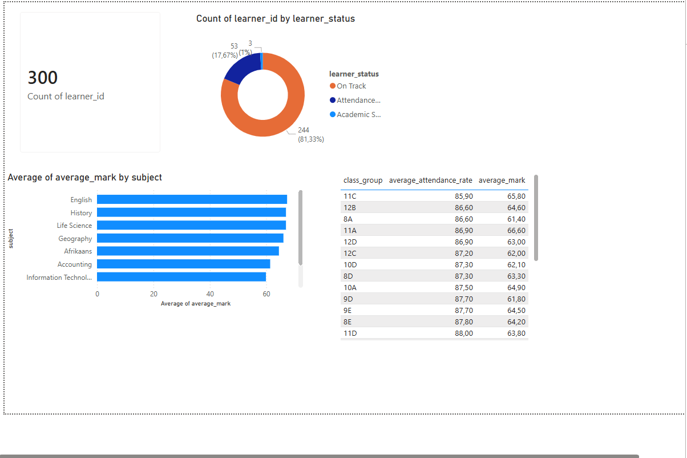
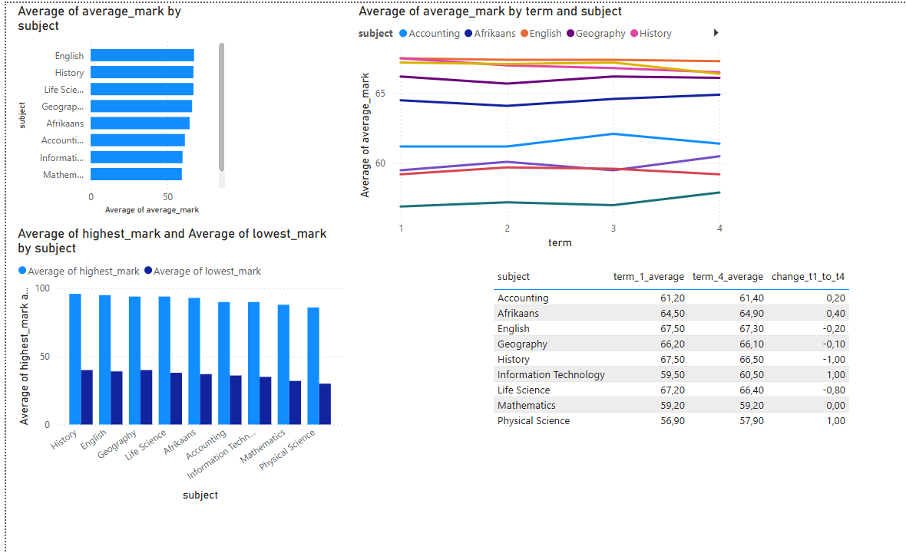
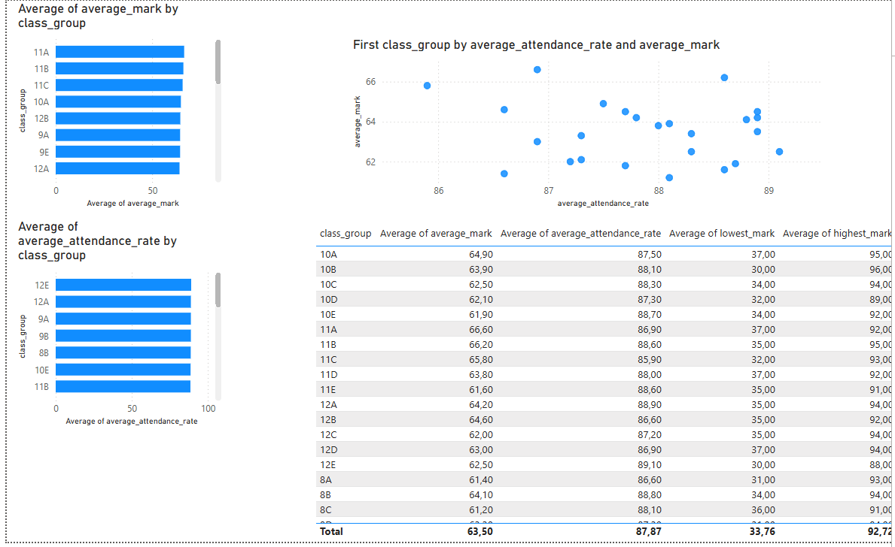
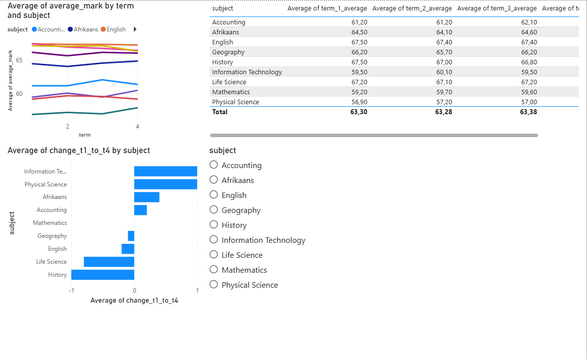
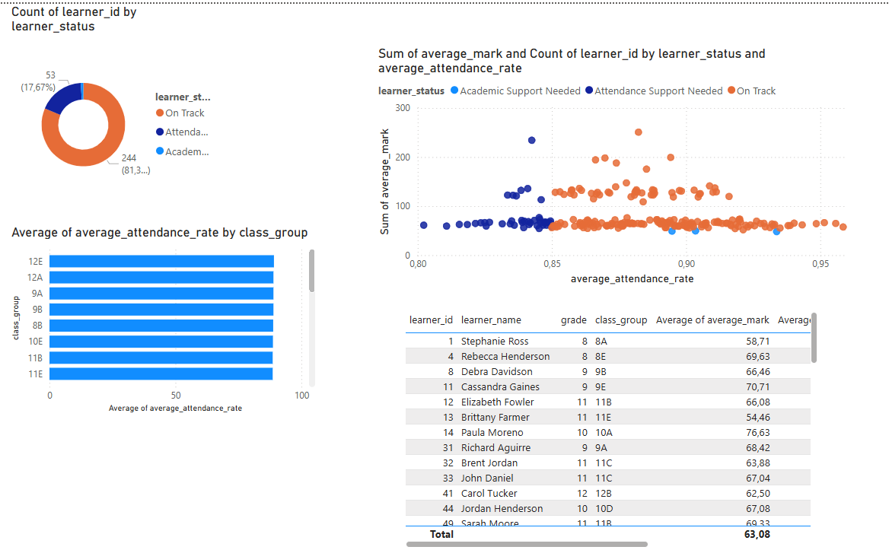

\# School Performance Analytics Dashboard


\## Project Overview


This project analyses synthetic school performance data to identify learner risk, subject performance trends, class-level differences, and attendance-related concerns.


The goal is to simulate a real-world education analytics project while using fake/anonymised data to avoid privacy issues.


\## Business Questions


This project answers the following questions:


\- Which learners may need academic or attendance support?

\- Which subjects are performing best and worst?

\- Which grades and classes show weaker performance?

\- Is poor attendance linked to weaker academic performance?

\- Which subjects are improving or declining over time?


\## Tools Used


\- Python

\- pandas

\- CSV data processing

\- Power BI

\- Data cleaning

\- Data analysis


\## Project Structure


```text

school-performance-dashboard/

│

├── data/

│   ├── raw/

│   └── cleaned/

│

├── reports/

├── scripts/

├── powerbi/

├── sql/

└── README.md


Key Outputs


The analysis produces several report files:


learner\_summary.csv

subject\_summary.csv

grade\_summary.csv

class\_summary.csv

class\_attendance\_summary.csv

combined\_class\_summary.csv

subject\_term\_summary.csv

subject\_trend\_change.csv

executive\_summary.txt

Key Insights

Physical Science and Mathematics are among the lowest-performing subjects.

Most learners are currently on track, but a significant number require attendance support.

Some classes show both lower average marks and lower attendance rates.

Subject performance is mostly stable across terms, with small changes between Term 1 and Term 4.

## Dashboard Screenshots

### Executive Overview


### Subject Performance


### Attendance and Risk


### Class Comparison


### Term Trends


